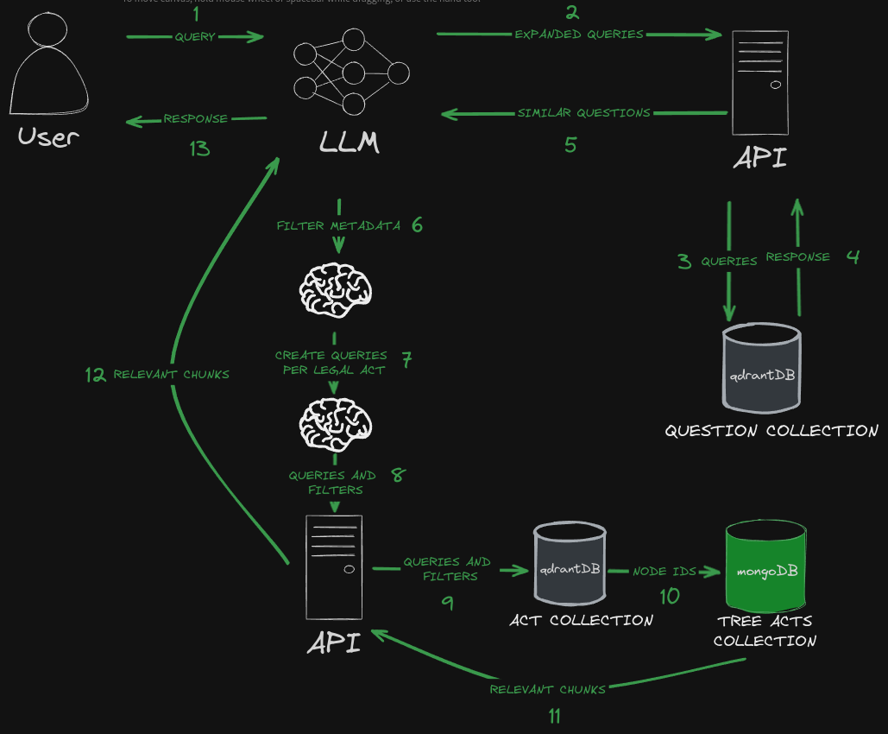

# Retrieval enhanced legal assistant

### Note: This application is for demonstrational purposes only. It has been obfuscated to disallow usage out of the box.
## Table of Contents

1. [Overview](#overview)
2. [Application Structure](#application-structure)
3. [Data Overview](#data-overview)
4. [Retrieval Implementations](#retrieval-implementations)
5. [Evaluations](#evaluations)
6. [Demo](#demo)
7. [Conclusions](#conclusions)

## Overview

Since the discovery of large language models' remarkable ability to perform logical reasoning, there has been a debate among researchers and professionals regarding the potential for these models to replace tasks currently performed by human experts.

This repository hosts an implementation of a Polish AI legal assistant that uses legal data to perform QA over legal acts, utilizing an extensive dataset of questions and answers, keywords, precise citations, and legal acts. 

It incorporates unique chunking strategies for statutory law through tree representation, alongside state-of-the-art transformers for semantic search in the Polish language.

## Application Structure

The core of the application is structured around an ETL (Extract, Transform, Load) pipeline that is responsible for handling legal data. It performs three primary functions: extracting data from various sources, transforming this data into a structured format, and loading it into the NoSQL database.

There are two main databases utilized within this system. The first is a NoSQL database, which is used for storing a comprehensive dataset that includes legal documents, keywords, and questions and answers (Q&A).

The second database is a specialized vector database, designed to store embeddings. Embeddings are high-dimensional vectors that represent the questions and legal documents in a numerical form, enabling efficient similarity searches.

At the heart of the interaction between these databases and the users is a FastAPI application. It facilitates the communication between the databases and the large language model. The model, serving as an AI agent, interprets user queries and fetches the required legal information from the databases.

Finally, there is the evaluation component, where the system's accuracy is analyzed based on the precise citations provided by specialized lawyers in response to user questions.

## Data Overview

The dataset designed to enhance large language models consists of three primary components: Q&A sessions, where users pose legal queries; legal documents, which provide the basis for answers; and keywords that highlight specific sections of these documents. The diagram below illustrates how these elements interact.

As depicted, each query is associated with a set of keywords and corresponding legal documents. The metadata for each document includes related sections, akin to paragraphs within the document. Keywords serve as connectors, linking questions to relevant sections of these documents.

Leveraging the hierarchical structure of Polish legal documents, which can be depicted as a tree (where a depth-first search would recreate the entire document), I have developed a creative algorithm. The algorithm extracts subtrees from leaf nodes, generating semantically distinct and meaningful segments, as illustrated in the following diagram.

This segmentation approach enables precise semantic searches, facilitates document reconstruction, and preserves inter-segment relationships, especially when the text length surpasses the limits imposed by RoBERTa encoder models. The dataset's structured interconnections enable the creation of advanced data retrieval strategies, further detailed in subsequent sections.

## Retrieval Implementations

This chapter describes two distinct approaches for extracting data. The initial approach relies solely on the user's original query as the basis for conducting similarity searches.

As illustrated in the diagram, the user's original query is essential for conducting searches. There are two primary methods: a straightforward search, where the query is converted into a vector and a similarity search is performed within the "qdrant" act collection, and a two-step search. In the latter, the query first identifies the most closely related questions, and then, utilizing the associated acts and keywords identified by legal professionals in the questions metadata, it refines the search to those specific acts and keywords. The most similar vectors are identified, and the documents are reconstructed hierarchically based on their node IDs, yielding the search results.

The second approach involves multiple uses of a large language model (LLM) within the retrieval process.

As depicted, incorporating LLMs as a reasoning mechanism enables more complex and refined search capabilities. Initially, the LLM can rephrase the original query to enhance search precision, given its expertise in specific domains. Furthermore, the LLM can generate multiple queries from the original, treating each as a distinct search to gather a broader range of results. These results are then merged and ranked using a technique known as reciprocal rank fusion. This method is advantageous as it explores various semantic contexts. The LLM can also refine the search by filtering through the metadata obtained from similar queries, selecting relevant keywords and acts while excluding those less likely to contain relevant legal information. Lastly, it can expand the query further, generating unique queries for each relevant act based on the metadata, enhancing the search's effectiveness.

There are many trade-offs to be considered, the time for the user to receive the answer, compute and possible hallucinations. In the next chapters I will discuss augmentation methods used during the experiments as well as some evaluations.
## Evaluations

The assessment of the retrieval system is conducted using methods that exclude the LLM from the retrieval loop and includes two primary strategies.

The **Naive Retrieval** strategy acts as a foundational comparison point, assessing the system's potential to extract pertinent information using increasingly detailed metadata.

The **Two-Phase Retrieval** strategy begins by identifying the most closely related questions from a corpus of 250,000 Q&A pairs. It then refines the search by utilizing the metadata from these similar questions to narrow the search scope.

For each search, the top 100 elements from the legal corpus are returned. In the two-phase retrieval, we initially search for the top 7 similar questions to minimize irrelevant data, which has proven to be the optimal number for this purpose.

### Strategy 1: Naive Retrieval

This approach tests the system's capability to directly fetch legal citations from an extensive corpus.

| **Approach**                                      | **Description**                                                               | **Accuracy** |
|---------------------------------------------------|-------------------------------------------------------------------------------|--------------|
| **Search All Acts**                               | Searches all acts based on the user query and contrasts with lawyer-provided citations. | **41%**      |
| **Filter by Lawyer's Acts**                       | Filters search results using only the acts cited by the lawyer, along with the initial query. | **64%**      |
| **Filter by Lawyer's Acts and Keywords**          | Applies both keywords and acts cited by the lawyer as metadata filters.       | **72%**      |

The maximum theoretical accuracy observed is 72%, achieved in scenarios where searches are precisely filtered through the metadata cited by the lawyer.

### Strategy 2: Two-Phase Retrieval

This strategy incorporates an initial phase of pinpointing questions similar to the user's query to refine search criteria, followed by a secondary phase that utilizes these refined criteria to improve citation retrieval efficiency.

#### First Phase Results of Two-Phase Retrieval

The initial phase involves analyzing questions similar to the user's query to extract relevant acts and keywords, yielding the following rounded results:

| **Metric**                                | **Result**                           |
|-------------------------------------------|--------------------------------------|
| **Total Act Hit Rate**                    | **90%**                              |
| **Total Keyword Hit Rate**                | **78%**                              |
| **Average Acts per First Search**         | **5**                                |
| **Average Keywords per First Search**     | **19**                               |

#### Second Phase Accuracy

The subsequent phase capitalizes on insights from the initial phase to improve retrieval accuracy through metadata filtering.

| **Description**                                            | **Accuracy** |
|------------------------------------------------------------|--------------|
| **Using only extracted acts as metadata filters**          | **49%**      |
| **Applying extracted acts and keywords as metadata filters** | **52%**    |

By selecting the top 100 elements and leveraging metadata, I managed to enhance accuracy from **41%** to **52%** simply by incorporating a classification step. It's worth noting that this result could potentially be improved further through various strategies, including hybrid searches with SPLADE embeddings, reranking, fine-tuning the embedding model, and, notably, incorporating the LLM into the loop.

Also, it is worth to mention that top 100 elements equates to about **10 000** tokens and in future where the context window size is not a limiting factor accuracy can be improved by simply retrieving more and more elements. 

Integrating the LLM would allow for multiple queries to vector databases based on the initial query, enabling the LLM to refine metadata filtering and create a tailored set of queries for each document to retrieve the most relevant act elements.

However, such an evaluation would entail significant resources; hence, this marks the current endpoint of my assessment.

## Demo

This section presents two demo scenarios showcasing different architectures.

### First Demo: Single-Shot Search
In the initial demo, I employ a straightforward single-shot search mechanism. The process begins with the user's initial query, then an LLM triggers a single API call. The application then autonomously handles the retrieval process, searching through similar questions, applying relevant filters to find relevant act chunks and subsequently delivering the pertinent information back to the LLM.

A visual representation of this architecture is provided below:

To better illustrate this interaction, a video demonstration is available:

https://github.com/soleksy/RAG/assets/60203776/3530c175-246f-49eb-918d-cde294cc8229

### Second Demo: Two-Step Interaction with Complex Reasoning
The second demo showcases a more sophisticated architecture involving a two-step interaction process that facilitates complex reasoning. Initially, the LLM analyzes the general components of the user's question to formulate appropriate queries for document retrieval. Subsequently, it generates custom filters for each document, enabling targeted queries. These queries are processed in batches asynchronously, ensuring efficient retrieval of relevant content.

The architecture of this complex interaction is depicted below:

A video demonstration of this interaction is also provided for a clearer understanding:

https://github.com/soleksy/RAG/assets/60203776/796a140c-2da0-460e-9766-4cccd6d91812

## Conclusions

In this project, I explored the integration of Large Language Models (LLMs) within a legal question-answering framework, demonstrating their potential to enhance legal research and consultation. Although the outcomes are promising, they underscore the necessity for further refinement before these systems can be reliably deployed in professional legal settings.

One significant limitation is the propensity of LLMs to produce "hallucinations," or generate information that may not be factually accurate or contextually relevant. This characteristic poses a critical challenge, especially in the legal domain where precision and reliability are paramount.

Despite these hurdles, the project serves as a foundational step toward harnessing the capabilities of LLMs for legal applications. It highlights the importance of ongoing development in areas such as data curation, model training, and the creation of domain-specific encoders to address the unique requirements of legal data processing.

Ethical considerations and the potential for misuse prevent the public release of the dataset and the operational deployment of the application in its current form. Nonetheless, the insights gained from this deep dive are valuable for the future development of AI-assisted legal tools.

The project illustrates both the potential and the challenges of applying state-of-the-art LLMs to specialized fields such as law. As I move forward, the focus will be on enhancing data preparation techniques, developing tailored models, and continually evaluating the ethical implications of deploying AI in sensitive domains.